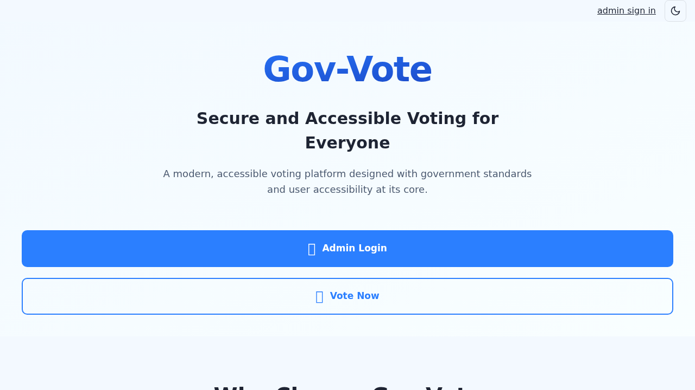
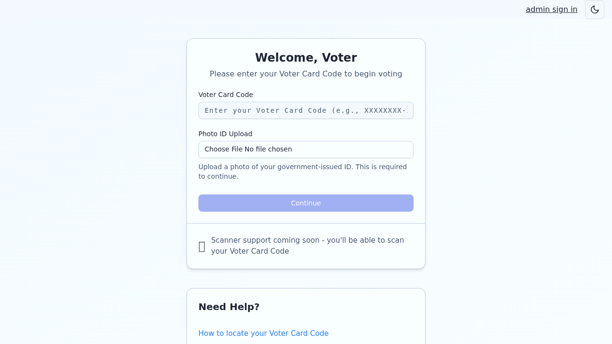
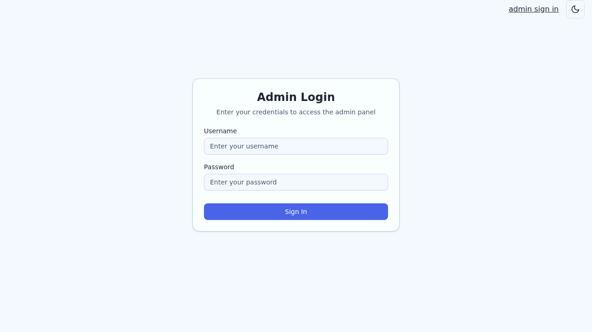

# Gov Vote

Gov Vote is a SvelteKit-based election workflow platform for managing contest groups, voter eligibility, voter cards, and ballot submission.

It supports two primary experiences:

- `Admin` workflow for configuring elections and managing voters.
- `Voter` workflow for card verification, ID photo upload, and ballot submission.

## Screenshots

### Home page



### Voter start page



### Admin login page



## Features

- Role-aware experience for `admin`, `super_admin`, and `voter` users.
- Contest group and contest management for election configuration.
- Voter eligibility assignment and voter card issuance.
- Voter start flow with ID photo upload before ballot access.
- Ballot UI with single and multi-select contest support.
- Ballot submission validation and secure recording of voter choices.
- Admin visibility into uploaded voter ID images (via authenticated proxy route).

## Tech Stack

- `SvelteKit` + `TypeScript`
- `Vite`
- `Drizzle ORM` + `drizzle-kit`
- `PostgreSQL` (via Neon-compatible driver)
- `Vitest` + `vitest-browser-svelte` + `Playwright`
- `@auth/sveltekit` for auth/session handling
- `@google-cloud/storage` for voter ID image storage

## Project Structure

- `src/routes/admin/**`: Admin pages and management workflows.
- `src/routes/voter/**`: Voter start and ballot experience.
- `src/routes/api/**`: API endpoints (token, eligibility, voter ID upload, etc.).
- `src/lib/server/db/**`: Drizzle schema and DB access.
- `drizzle/`: SQL migrations and migration metadata.

## Getting Started

### 1. Install dependencies

```bash
npm install
```

### 2. Configure environment variables

Create a `.env` file and configure your runtime values (database, auth secret, etc.).

For Google Cloud Storage uploads, configure at least one of:

- `GCP_SERVICE_ACCOUNT_KEY_JSON`
- `GCP_SERVICE_ACCOUNT_KEY_BASE64`

You can also set:

- `GCP_PROJECT_ID`

### 3. Apply database migrations

```bash
npm run db:migrate
```

or, for schema synchronization during development:

```bash
npm run db:push
```

### 4. Start the app

```bash
npm run dev
```

App runs locally at `http://localhost:5173` by default.

## Common Commands

```bash
npm run dev            # start development server
npm run build          # production build
npm run preview        # preview production build
npm run check          # svelte-check + type checks
npm run lint           # prettier check
npm run format         # prettier write
npm run test           # run all tests once
npm run test -- <file> # run a single test file
```

## Core Workflows

### Admin workflow

1. Admin authenticates via `/admin/login`.
2. Creates and manages contest groups and polling stations.
3. Assigns voter eligibility and generates voter cards.
4. Reviews voters, voter cards, and voter ID uploads.

### Voter workflow

1. Voter enters voter card code at `/voter/start`.
2. Voter uploads government ID image.
3. Voter proceeds to `/voter/ballot` and completes all contests.
4. Ballot is submitted and session ends.

## Notes on Voter ID Images

- Uploaded voter ID images are stored in GCS and should remain private.
- Admin UI should load images through authenticated app routes (server proxy) rather than direct public bucket URLs.
- If direct GCS links are used for private objects, browsers will return `403 Forbidden`.

## Testing

This project includes:

- Unit-style tests for validators and server-side logic.
- Browser UI tests for Svelte pages.

Example:

```bash
npm run test -- src/routes/voter/ballot/page.svelte.spec.ts
```
